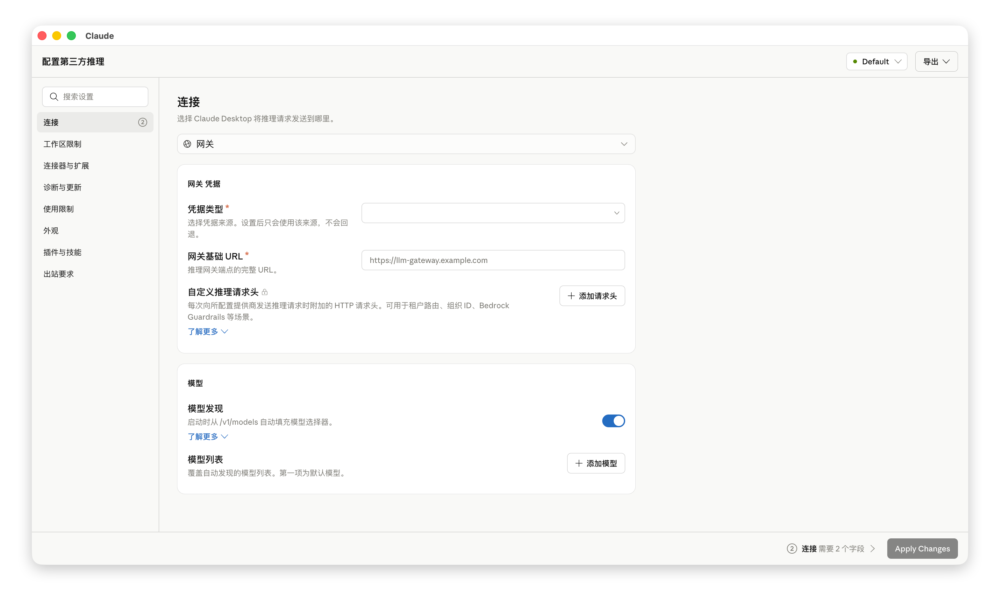
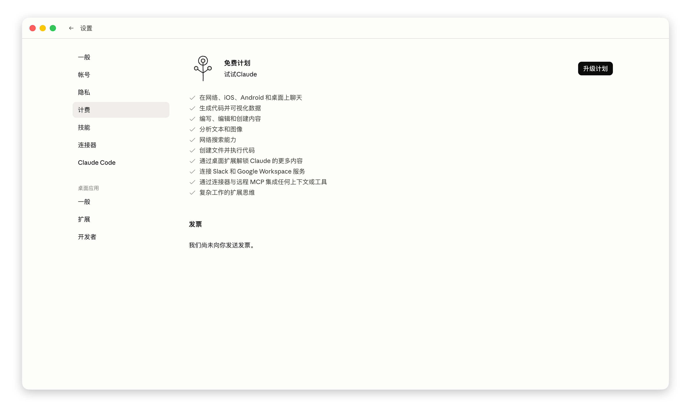

# Claude Desktop 中文补丁

一个用于 Claude Desktop 的中文界面汉化补丁，支持简体中文、繁体中文（中国台湾）和繁体中文（中国香港）。

本汉化方案支持使用 API 和官方订阅的方式。第三方api请先参照 https://linux.do/t/topic/2032192 配置。

**遇到问题请及时反馈，欢迎扫码加入 claude desktop 交流。**

## 界面截图

 

## 功能特点

- 一键安装 Claude Desktop 中文界面资源，支持 macOS 和 Windows。
- 支持三种中文变体：`zh-CN`（简体中文）、`zh-TW`（繁体中文（中国台湾））、`zh-HK`（繁体中文（中国香港））。
- 自动给 Claude 前端语言白名单加入当前选择的中文变体。
- 会修改 `app.asar` 的安装模式可对在线账号登录后的 `claude.ai` 页面做显示层 DOM 翻译；该逻辑只改界面文本和语言状态，不改第三方 API、网关、模型路由或请求内容。
- macOS 自动合并当前 Claude 版本的英文语言文件与随包中文翻译。
- 新版本新增但暂未翻译的字段会保留英文，避免界面缺失文本。
- macOS 可绕过新版 Claude Desktop 对 3P gateway 模型名的本地 Anthropic 校验，避免 `deepseek-v4-pro` / `kimi-*` 等模型名导致配置整体失效。
- Windows 安装应用会直接备份并修改当前 Claude Desktop 的资源文件；卸载时从备份恢复。注意：修改 `app.asar` 后需要同步改写 `Claude.exe` 内嵌完整性哈希，这会破坏 Authenticode 签名；Cowork 沙箱/截图工作区需要签名验证，建议需要 Cowork 时选择 Windows 模式 1，并在网关或 ccswitch 中做模型别名映射。
- macOS 安装前自动备份原始 `/Applications/Claude.app`。
- 自动写入 Claude 用户配置，将语言设置为所选中文变体。

## 适用环境

- macOS 12+ 或 Windows 10+
- 已安装 Claude Desktop

## 使用方式

### macOS

1. 从 [GitHub Releases](https://github.com/javaht/claude-desktop-zh-cn/releases) 下载对应平台安装包（macOS .dmg）
2. 安装并启动 Claude-Zh 桌面应用
3. 在 UI 选语言（zh-CN / zh-TW / zh-HK）和模式（safe = Cowork 兼容；official = 官方账号登录在线汉化）
4. 点"安装补丁"执行汉化；点"卸载补丁"还原
5. UI 内三张 toggle 卡：自动更新开关、启动应用、试运行
6. 安装/卸载需要管理员权限，应用会自动弹系统授权

### Windows

1. 从 [GitHub Releases](https://github.com/javaht/claude-desktop-zh-cn/releases) 下载对应平台安装包（Windows .exe）
2. 安装并启动 Claude-Zh 桌面应用
3. 在 UI 选语言（zh-CN / zh-TW / zh-HK）和模式（safe = Cowork 兼容；official = 官方账号登录在线汉化）
4. 点"安装补丁"执行汉化；点"卸载补丁"还原
5. UI 内三张 toggle 卡：自动更新开关、启动应用、试运行
6. 安装/卸载需要管理员权限，应用会自动弹系统授权

## 仓库结构

- `apps/desktop/` — Tauri + React 桌面应用
- `apps/desktop/src-tauri/` — Tauri 后端（Rust）
- `crates/core/` — 纯逻辑（asar 处理、json 合并、补丁规则）
- `crates/platform/` — 平台 IO（环境检测、提权、文件操作、CC Switch skills）
- `resources/` — 语言包（frontend/desktop/statsig/Localizable）
- `.github/workflows/` — GitHub Actions

## macOS 安装会做什么

- 安装时备份当前 `/Applications/Claude.app` 到同目录，名字类似：
  `Claude.backup-before-zh-CN-20260424-120000.app`
- 恢复 / 卸载时选择同目录下最早的 `Claude.backup-before-zh-CN-*.app` 恢复为 `/Applications/Claude.app`，并删除其他备份。
- 复制 Claude.app 到临时目录并打补丁。
- 给前端语言白名单加入当前选择的中文变体。
- 对 `Contents/Resources/app.asar` 做等长补丁，关闭 3P gateway 启动阶段的 `inferenceModels` Anthropic 名称校验；安全模式会跳过这一步。
- 安全模式仍会对主进程菜单中的硬编码英文做等长汉化补丁，覆盖开发者菜单等少量不走资源文件的菜单项。
- 普通安装模式会在在线账号登录 / 聊天页面注入显示层 DOM 翻译，覆盖聊天、项目、Artifacts 等远程页面；安全模式会跳过此项，因为它需要修改 `app.asar`。
- 合并当前 Claude 版本的 `en-US.json` 和随包中文翻译：
  当前版本已有中文翻译的 key 会变中文，新版本新增但本包没有的 key 会保留英文，避免应用缺字段。
- 写入 `~/Library/Application Support/Claude/config.json`，设置 `"locale"` 为所选语言代码（`zh-CN`、`zh-TW` 或 `zh-HK`），并在 `claude.ai` 页面加载前同步其前端语言状态。
- 对修改后的 Claude.app 及其内部 app/framework/原生二进制做一致的本机 ad-hoc 重签名，并清除 `com.apple.quarantine` 隔离属性。
- 重新启动 Claude。
- 自动更新控制和 CC Switch skills 同步在应用 UI 中操作。

## Windows 安装会做什么

- 查找 Windows 版 Claude Desktop 安装目录。
- 修改前备份将被改动的前端 JS bundle、`app.asar` 和 `Claude.exe` 到 `resources\.zh-cn-backups`。
- 复制本仓库现有中文资源，不使用其他语言包项目里的 JSON：
  - `resources/frontend-zh-CN.json` / `frontend-zh-TW.json` / `frontend-zh-HK.json` -> `ion-dist\i18n\` 对应语言代码 `.json`
  - `resources/desktop-zh-CN.json` / `desktop-zh-TW.json` / `desktop-zh-HK.json` -> `resources\` 对应语言代码 `.json`
  - `resources/statsig-zh-CN.json` / `statsig-zh-TW.json` / `statsig-zh-HK.json` -> `ion-dist\i18n\statsig\` 对应语言代码 `.json`
- 给前端语言白名单加入当前选择的中文变体。
- 汉化前端 bundle 中未走 i18n JSON 的硬编码界面文本，例如侧边栏入口、配置页标签和模型选择项。
- 官方账号登录模式和第三方 API 实验模式会在在线账号登录 / 聊天页面注入显示层 DOM 翻译，覆盖聊天、项目、Artifacts 等远程页面；Cowork 兼容模式会跳过此项，因为它需要修改 `app.asar`。
- 第三方 API 实验模式会对 unpackaged 版本的 `resources\app.asar` 做等长补丁，关闭 3P gateway 启动阶段的 `inferenceModels` Anthropic 名称校验，并同步更新 asar 内部文件完整性信息和 `Claude.exe` 内嵌的 asar header hash。
- Windows 的模式 2 和 3 会直接改写当前 Claude 的 `app.asar` 并同步改写 `Claude.exe` 内嵌完整性哈希，导致 Authenticode 签名 `HashMismatch`；Cowork VM 服务可能拒绝客户端并报 `RPC pipe closed`。如果需要 Cowork 沙箱/截图工作区，请使用模式 1，并通过网关/ccswitch 模型别名映射解决第三方模型名校验。
- 写入 Windows 用户配置，将语言设置为所选语言代码（`zh-CN`、`zh-TW` 或 `zh-HK`）。
- 自动更新控制和 CC Switch skills 同步在应用 UI 中操作。
- 重启 Claude Desktop。

## 卸载 / 恢复

在应用 UI 中点击"卸载补丁"即可。

## Star History

## 免责声明

本项目为非官方中文补丁，仅修改本机 Claude Desktop 的本地资源文件。Claude Desktop 更新后资源结构可能变化，若补丁失败，请先更新本项目或重新运行安装应用。
