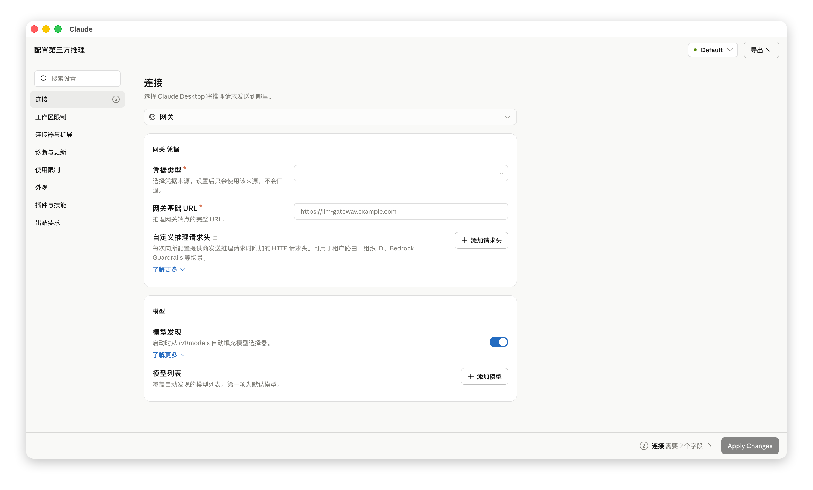

# Claude Desktop 中文补丁

一个用于 Claude Desktop 的本地中文界面补丁，支持简体中文、繁体中文（中国台湾）和繁体中文（中国香港）。

macOS 双击 `install-mac.command`；Windows 双击 `install-windows.bat` 后按 UAC 提示授权。脚本会给 Claude Desktop 添加中文语言选项并安装中文界面资源。

本项目支持官方账号和第三方 API，但不同安装模式覆盖的界面与 Cowork 兼容性不同，请先阅读下方的模式说明。第三方 API 配置可参考 [这篇教程](https://linux.do/t/topic/2032192)。


**遇到问题请及时反馈，欢迎扫码加入 claude desktop 交流。**


## 界面截图

 

## 功能特点

- 一键安装 Claude Desktop 中文界面资源，支持 macOS 和 Windows。
- 安装后启用受保护的自动修复服务：Claude Desktop 更新覆盖资源后，自动识别新版本并重新应用已选择的语言和模式。
- 支持三种中文变体：`zh-CN`（简体中文）、`zh-TW`（繁体中文（中国台湾））、`zh-HK`（繁体中文（中国香港））。
- 按语义定位前端资源和语言白名单，不再依赖固定的 `assets/v1` 目录或完整语言数组；保留新版新增的所有内置语言。
- 完整/官方账号模式会修改 `app.asar`，对在线账号登录后的 `claude.ai` 页面做显示层 DOM 翻译；该逻辑只改界面文本和语言状态，不改第三方 API、网关、模型路由或请求内容。
- macOS 会合并当前 Claude 版本的英文语言文件与随包中文翻译；新版本新增但暂未翻译的字段保留英文，避免界面缺失文本。
- macOS 完整补丁模式可绕过新版 Claude Desktop 对第三方网关模型名的本地 Anthropic 校验，避免 `deepseek-v4-pro` / `kimi-*` 等模型名导致配置整体失效；跳过结构性 `app.asar` 的模式不包含此功能。
- Windows 安装脚本会备份并修改当前 Claude Desktop 的资源文件，卸载时从备份恢复。需要 Cowork 沙箱或截图工作区时应选择 Windows 模式 1。
- macOS 安装前自动备份原始 `/Applications/Claude.app`。
- 备份恢复会核对 Claude build 和原始 `app.asar` 指纹；更新后的新版绝不会被旧备份降级覆盖，安装提交失败也会自动回滚原版。
- 自动写入 Claude 用户配置，将语言设置为所选中文变体。

## 适用环境

- macOS 或 Windows
- 已安装 Claude Desktop
- macOS 需要可用的 Python 3；脚本优先使用 `/usr/bin/python3`，不存在时从 `PATH` 查找 `python3`
- Windows 需要系统自带的 Windows PowerShell（`powershell.exe`）；批处理入口会自动请求管理员权限

## 使用方式

### 国内用户下载

无法顺畅访问 GitHub 时,可用以下方式获取本项目(安装器的新版检测已内置 jsDelivr 回退,无需翻墙也能收到更新提醒):

1. **Gitee 镜像**(若维护者已启用):`https://gitee.com/<镜像地址>`,克隆或下载 zip 与 GitHub 相同。
2. **公共加速站**:在 GitHub 下载链接前加上加速前缀,例如:
   ```text
   https://ghfast.top/https://github.com/javaht/claude-desktop-zh-cn/archive/refs/heads/main.zip
   ```
   同类站点还有 `gh-proxy.com` 等,失效时可自行搜索「GitHub 加速」替换前缀。
   > ⚠️ 加速站是第三方中转,理论上存在内容被篡改的风险。本项目的安装脚本会以管理员权限运行,请尽量优先使用直连或 Gitee 镜像;使用加速站下载后,建议与群内发布的文件比对大小/哈希。
3. **用户群**:关注群公告发布的安装包(见项目主页)。

### macOS

1. 退出 Claude Desktop。
2. 下载或克隆本项目。
3. 双击 `install-mac.command`，选择操作：
   - `1` 完整补丁：支持官方账号和第三方 API；会修改 `app.asar`，包含在线页面 DOM 汉化、在线语言锁定、第三方模型名校验绕过和 `app.asar` 内模型选择器汉化。此模式不适合依赖 Cowork 沙箱/工作区的场景。
   - `2` 基础兼容模式：安装中文资源、注册中文语言并汉化前端 bundle，完全不读写 `app.asar`；不会注入在线页面 DOM 汉化、主进程菜单或模型校验绕过。此模式仍会对应用做本机 ad-hoc 重签名，不承诺 Cowork 可用。
   - `3` 恢复原样 / 卸载补丁。
   - `4` 自动更新设置：输入 `y` 禁止自动更新，输入 `n` 允许自动更新。
   - `5` CC Switch skills 同步：输入 `y` 同步，输入 `n` 删除之前的同步。
4. 选择安装后，脚本只会恢复与当前已打补丁 build 和源指纹完全匹配的备份；检测到官方新版时保留新版并丢弃不兼容旧备份。
5. 选择语言：`1`=简体中文，`2`=繁体中文（中国台湾），`3`=繁体中文（中国香港）。
6. 按提示输入 Mac 登录密码。安装完成后 Claude 会自动重新打开，并安装 root 所有、普通用户不可修改的更新自动修复服务。
7. 如果没有自动切换，打开左下角账号菜单，选择 `Language` -> 对应的中文选项。

CC Switch skills 同步会扫描 `~/.cc-switch/skills` 下包含 `SKILL.md` 的目录，只为 Claude Desktop 中不存在的同名 skill 创建软链接并更新 skills manifest。取消同步只删除由该目录同步出的软链接和对应记录，不删除 CC Switch 源目录。

### Windows

1. 退出 Claude Desktop。
2. 下载或克隆本项目。
3. 双击 `install-windows.bat`；脚本会复制安装文件到当前用户的临时目录，并弹出 UAC 管理员授权窗口。
4. 先选择安装模式：
   - `1` Cowork 兼容 / 第三方 API 模式：跳过 `app.asar` 和 `Claude.exe` 内嵌完整性哈希修改；仍会安装中文资源、注册中文语言并汉化前端 bundle。在线账号页面中依赖 DOM 注入的文本不会被覆盖，第三方模型需在网关或 CC Switch 中映射为 Claude/Anthropic 风格名称。
   - `2` 官方账号在线汉化模式：修改 `app.asar` 并同步改写 `Claude.exe` 内嵌完整性哈希，补充在线页面 DOM、主进程菜单和模型选择器汉化。该操作会使 `Claude.exe` 的 Authenticode 签名变为 `HashMismatch`，Cowork 沙箱/工作区可能拒绝启动。
   - `3` 恢复原样 / 卸载补丁。
   - `4` 自动更新设置：输入 `y` 禁止自动更新，输入 `n` 允许自动更新。
   - `5` CC Switch skills 同步：输入 `y` 开启同步，输入 `n` 删除之前的同步。
5. 选择安装中文补丁时，脚本只会恢复带本项目 marker 的当前版本备份；官方更新后的新版本不会回灌旧文件。
6. 选择语言：`1`=简体中文，`2`=繁体中文（中国台湾），`3`=繁体中文（中国香港）。
7. 脚本会备份被修改的文件、写入中文资源、重启 Claude Desktop，并注册管理员保护目录中的自动修复计划任务。如果没有自动切换，打开左下角账号菜单，选择 `Language` -> 对应的中文选项。

## 更新后自动恢复与新版兼容

- 自动修复只运行本次安装时复制的脚本和语言资源，不会以 root/SYSTEM 身份从网络下载或执行新代码。
- macOS payload 位于 `/Library/Application Support/ClaudeDesktopZhCN`，由 LaunchDaemon 在检测到官方更新时立即检查（监听 `Claude.app/Contents/Info.plist` 变化），并以每 5 分钟轮询作为兜底；Windows payload 位于 `%ProgramData%\ClaudeDesktopZhCn`，由计划任务检查。两处目录都只允许系统或管理员修改。
- 检测到 Claude 刚更新或文件仍在变化时会等待下一次检查，避免与官方更新器并发写入。macOS 在版本稳定后会受控退出并恢复原先正在运行的 Claude；Windows 会等 Claude/Cowork 关闭后再修复，避免中断会话。
- 新版只要基础 i18n 布局仍可语义识别，就会合并当前版本的 `en-US.json`：已有中文继续使用中文，新增加的 key 自动回退英文，不会因旧语言包缺 key 而显示空白。
- 完整模式的 `app.asar` 增强锚点若不兼容，两端都会先回滚本次修改，再自动重试完全不改 `app.asar` 的基础模式；macOS 的真实官方应用在临时副本验证成功前不会被替换。
- 同一 build 自动修复失败后会退避，不会每几分钟反复中断 Claude。此时请下载本项目新版再安装；新版安装会同步更新受保护的自动修复 payload。

macOS 可先做只读兼容诊断：

```bash
/usr/bin/python3 scripts/patch_claude_zh_cn.py --doctor --json
```

诊断会输出 Claude 精确版本、动态发现的 i18n/JS 路径、语言白名单候选和完整模式的主进程 bundle，不修改应用。

## 文件说明

- `install-mac.command`：macOS 双击运行入口。
- `install-windows.bat`：Windows 安装 / 恢复菜单入口。
- `scripts/install_windows.ps1`：Windows 汉化安装和卸载脚本。
- `scripts/patch_claude_zh_cn.py`：真正执行补丁的 Python 脚本。
- `scripts/macos_auto_repair.py`：macOS 更新检测与安全退避控制器。
- `tests/test_patcher.py`：不依赖本机 Claude 安装的多版本布局、备份和原子提交回归测试。
- `resources/manifest.json` / `manifest-zh-TW.json` / `manifest-zh-HK.json`：语言包信息。
- `resources/frontend-zh-CN.json` / `frontend-zh-TW.json` / `frontend-zh-HK.json`：Claude 前端界面中文翻译。
- `resources/frontend-hardcoded-zh-CN.json` / `frontend-hardcoded-zh-TW.json` / `frontend-hardcoded-zh-HK.json`：未走 i18n key 的前端硬编码文本映射，也用于在线账号页面的 DOM 翻译表。
- `resources/desktop-zh-CN.json` / `desktop-zh-TW.json` / `desktop-zh-HK.json`：Claude 桌面壳层中文翻译。
- `resources/Localizable.strings` / `Localizable-zh-TW.strings` / `Localizable-zh-HK.strings`：macOS 原生菜单中文资源。
- `resources/statsig-zh-CN.json` / `statsig-zh-TW.json` / `statsig-zh-HK.json`：statsig i18n 兜底资源。
- `resources/release.json`：安装入口用于检查是否有新版的版本信息(GitHub API 不可达时自动回退 jsDelivr)。
- `.github/workflows/sync-gitee.yml`：GitHub → Gitee 镜像自动同步(维护者按文件内注释配置 `GITEE_TOKEN` 等后生效,未配置时自动跳过)。

## macOS 脚本会做什么

- 安装时备份当前 `/Applications/Claude.app` 到同目录，名字类似：
  `Claude.backup-before-zh-CN-20260424-120000.app`
- 安装前只恢复 marker 中记录的当前 Claude build 和原始 `app.asar` 指纹所对应的备份；当前是官方更新后的未标记新版时绝不恢复旧版。
- 恢复 / 卸载同样要求备份指纹匹配；匹配不到时保留当前应用并拒绝不安全恢复。
- 复制 Claude.app 到临时目录并打补丁。
- 给前端语言白名单加入当前选择的中文变体。
- 两种安装模式都会汉化前端 bundle 中未走 i18n key 的硬编码文本，并修正中文语言显示名称。
- 完整补丁模式会修改 `Contents/Resources/app.asar`：注入在线账号页面 DOM 翻译和语言锁定、汉化主进程菜单及模型选择器，并用等长替换关闭第三方网关模型名校验。
- 基础兼容模式不会执行上述结构性注入、菜单替换或模型校验绕过，`app.asar` 与 Electron 完整性信息保持逐字节不变。
- 合并当前 Claude 版本的 `en-US.json` 和随包中文翻译：
  当前版本已有中文翻译的 key 会变中文，新版本新增但本包没有的 key 会保留英文，避免应用缺字段。
- 写入 `~/Library/Application Support/Claude/config.json`，设置 `"locale"` 为所选语言代码（`zh-CN`、`zh-TW` 或 `zh-HK`）。完整补丁模式还会在在线页面加载时同步并锁定前端语言状态。
- 对修改后的 Claude.app 及其内部 app/framework/原生二进制做一致的本机 ad-hoc 重签名，并清除 `com.apple.quarantine` 隔离属性。
- 重新启动 Claude。
- 把本次补丁器、语言资源和选择复制到 root 所有的受保护目录，并加载定时检查服务；更新后的 app 稳定落盘后会自动在临时副本重新汉化。
- 可选菜单项 `4` 用 `y/n` 控制 Claude Desktop 自动更新：`y` 禁止自动更新，`n` 允许自动更新。若当前存在有效的 Claude-3p `configLibrary`，脚本会写入当前 applied 配置；否则写入 Claude Desktop enterprise policy。
- 可选菜单项 `5` 用 `y/n` 控制 CC Switch skills 同步：`y` 会把 `~/.cc-switch/skills` 中缺失的 skill 软链接到 Claude Desktop 的本地 skills 目录，并更新对应 `manifest.json`；`n` 只删除之前同步产生的 CC Switch 软链接和对应 manifest 记录。该操作不需要管理员权限，不会覆盖同名 skill。

## Windows 脚本会做什么

- 查找 Windows 版 Claude Desktop 安装目录。
- 安装前仅在当前版本带有效补丁 marker 时从 `resources\.zh-cn-backups` 恢复；marker 缺失表示官方新版或干净安装，不会跨版本回灌旧备份。
- 修改前只备份实际会改动的文件到 Claude 安装目录下的 `resources\.zh-cn-backups`；模式 1 不修改 `app.asar` 或 `Claude.exe`，模式 2 会备份并修改它们。
- 将本仓库中文翻译与当前 Claude 版本英文资源按 key 合并，不使用其他语言包项目里的 JSON：
  - `resources/frontend-zh-CN.json` / `frontend-zh-TW.json` / `frontend-zh-HK.json` -> 动态发现的主前端 `i18n` / `locales` 目录中对应语言代码 `.json`
  - `resources/desktop-zh-CN.json` / `desktop-zh-TW.json` / `desktop-zh-HK.json` -> `resources\` 对应语言代码 `.json`
  - `resources/statsig-zh-CN.json` / `statsig-zh-TW.json` / `statsig-zh-HK.json` -> 上述动态目录的 `statsig\` 子目录
- 给前端语言白名单加入当前选择的中文变体。
- 汉化前端 bundle 中未走 i18n JSON 的硬编码界面文本，例如侧边栏入口、配置页标签和模型选择项。
- 模式 2 会在在线账号登录 / 聊天页面注入显示层 DOM 翻译，覆盖聊天、项目、Artifacts 等远程页面；模式 1 会跳过此项，因为它需要修改 `app.asar`。
- Windows 的模式 2 会直接改写当前 Claude 的 `app.asar` 并同步改写 `Claude.exe` 内嵌完整性哈希，导致 Authenticode 签名 `HashMismatch`；Cowork VM 服务可能拒绝客户端并报 `RPC pipe closed`。如果需要 Cowork 沙箱/截图工作区，请使用模式 1，并通过网关或 CC Switch 模型别名映射解决第三方模型名校验。
- 如果模式 2 在新版 Claude 上没有通过结构或完整性验证，安装事务会恢复本次改动并自动改用模式 1；两种模式都失败时才记录该 build 的失败状态并停止重复尝试。
- 写入 Windows 用户配置，将语言设置为所选语言代码（`zh-CN`、`zh-TW` 或 `zh-HK`）。
- 可选菜单项 `4` 用 `y/n` 控制 Claude Desktop 自动更新：`y` 禁止自动更新，`n` 允许自动更新。若当前存在有效的 Claude-3p `configLibrary`，脚本会写入当前 applied 配置；否则写入 `HKCU\SOFTWARE\Policies\Claude` policy。
- 可选菜单项 `5` 用 `y/n` 控制 CC Switch skills 同步：`y` 会把 `%USERPROFILE%\.cc-switch\skills` 中缺失的 skill 以软链接加入 Claude Desktop 的本地 skills 目录，并把 `SKILL.md` frontmatter 里的 `name` 和 `description` 写入对应 `manifest.json`；`n` 只删除之前同步产生、且指向 CC Switch skills 目录内的软链接和对应 manifest 记录。脚本会从当前用户的 AppData 动态扫描 Claude-3p skills plugin，不写死 session UUID，不覆盖同名 skill，也不删除 CC Switch 源目录。
- 重启 Claude Desktop。
- 把维护脚本和语言资源复制到 ACL 受保护的 `%ProgramData%\ClaudeDesktopZhCn` 并注册计划任务；新版本目录稳定且 Claude 未运行时自动重新应用。

## 卸载 / 恢复

执行对应平台的安装入口并选择 `3`。macOS 只恢复与当前 marker 精确匹配的原版备份；Windows 只恢复当前版本的 marker 备份。两端都会先停用并删除自动修复服务，随后把用户语言设置恢复为 `en-US`，不会出现“刚卸载又被后台补回”的情况。

## 注意事项

- Claude Desktop 更新会覆盖应用内部资源，但自动修复服务会在更新完成后重新应用汉化。若新版基础结构不兼容，服务会保留官方英文应用并停止高频重试；此时更新本项目后重新安装即可。
- macOS 两种安装模式都会对修改后的应用做本机 ad-hoc 重签名；Windows 模式 2 会破坏 `Claude.exe` 的 Authenticode 签名。签名相关功能是否可用，应以当前 Claude Desktop 版本的实际验证结果为准。
- 在线账号页面由 `claude.ai` 动态更新，DOM 汉化依赖英文原文匹配；上游文案变化后可能出现少量漏翻，需要更新本项目词表。

## Star History

[](https://www.star-history.com/#javaht/claude-desktop-zh-cn&Date)

## 免责声明

本项目为非官方中文补丁，会修改本机 Claude Desktop 的资源文件及相关本地配置，不会修改 Claude 服务端账号数据。Claude Desktop 更新后资源结构可能变化；若补丁失败，请先恢复原版应用并更新本项目，不要在安装未完成的状态下反复运行脚本。
